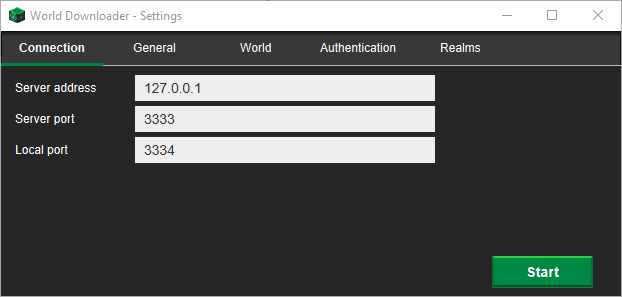

# ReplayMod World Downloader

## What is this?
This is a small script that you can use together with [Mircokroon's world downloader](https://github.com/mircokroon/minecraft-world-downloader) to extract the world data from a replay.

## Usage
1. Install [Python3](https://www.python.org/downloads/)
2. Install [Mircokroon's world downloader](https://github.com/mircokroon/minecraft-world-downloader)
3. Use the following settings:
   
4. Run server.py
   ```sh
   python3 server.py replay.mcpr
   ```
5. Wait for the world downloader to finish

## License

Distributed under the MIT License. See `LICENSE` for more information.
